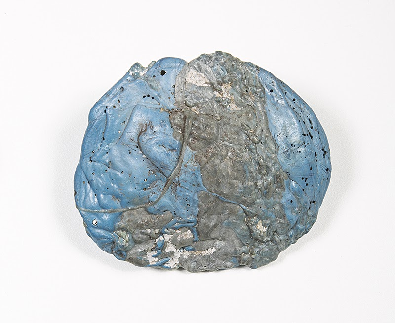
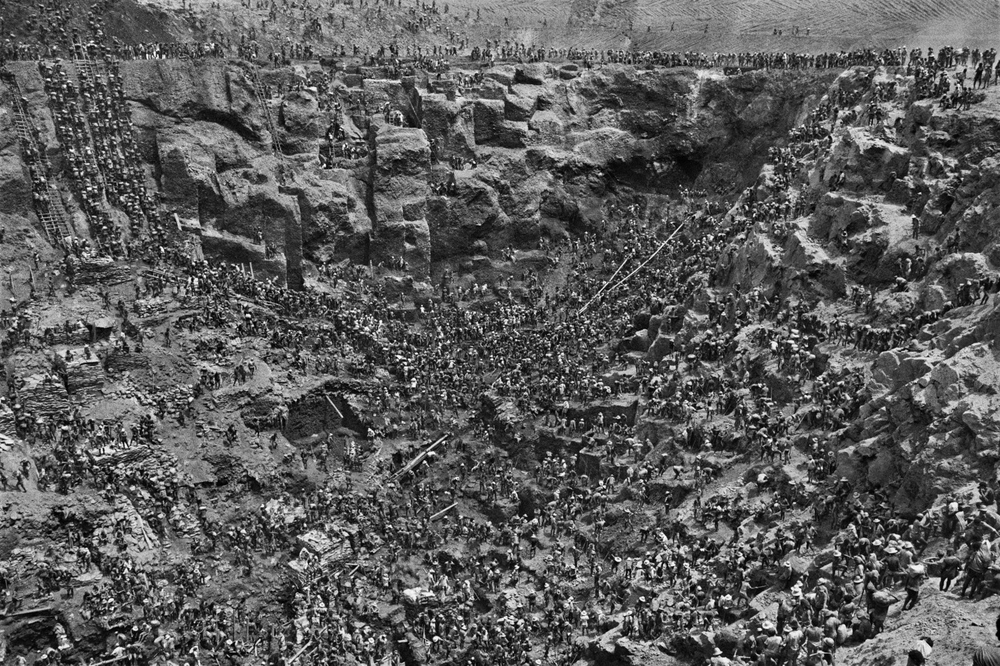

## Définir un cadre : quelle place pour l’Homme sur quelle Terre ?

### Anthropocène

L’anthropocène est un terme utilisé pour indiquer l’empreinte des activités humaines dans le temps géologique et physique de la Terre. Cela veut dire que l’extraction minière, l’utilisation d’énergies fossiles, la déforestation, l’acidification et la pollution des océans sont, entre autres, des marqueurs durables de notre présence sur Terre. Dans un futur proche, des scientifiques pourront observer les hausses des gaz à effet de serre liées aux activités industrielles modernes dans les glaces des pôles. Des géologues pourront retrouver aussi des plastiques sédimentés sur l’ensemble de la superficie terrestre, d’ailleurs, ces plastiques sont aujourd’hui appelés “plastiglomérats”[^3].

<figure>

    <figcaption>Exemple de plastiglomérat</figcaption>
</figure>

Les températures moyennes sur le globe terrestre indiquent une tendance à la hausse pour les centaines d’années à venir dûe à nos émissions de gaz à effet de serre (GES) contemporaines. Les océans seront plus chauds, plus acides et plus pollués du fait de plusieurs activités humaines. Les océans captent une partie du réchauffement global et s’acidifent en conséquence. Ces mêmes océans sont aussi pollués depuis les années 1950 par les plastiques et des particules radioactives. Il faut toutefois se rappeler que l’Homme laisse des traces de son activité sur Terre depuis le début de sa vie collective, les indiens d’Amazonie pratiquent la culture sur brûlis et transforment à leur façon la forêt depuis des millénaires, les ouvrages hydrauliques chinois du premier millénaire ont modifié le flux de leurs grands fleuves comme le Yang-Tsé-Kiang (长江). Une équipe de chercheurs a même pu corréler la présence de plomb dans les glaces du Groenland avec les différents évènements qui ont parcouru l’empire romain. Les périodes de croissance favorisaient la frappe de nouvelle monnaie, dont l’extraction minière d’or et sa fonte provoquent l’émanation de plomb dans l’atmosphère. Lors des périodes de crise, la frappe de monnaie diminuait entraînant ainsi la baisse de l’extraction d’or et des émanations de plomb[^4].

Ce qui est en jeu aujourd’hui n’est cependant pas du même acabit. Pour un observateur extérieur qui examinerait les traces de nos sociétés contemporaines il pourrait sembler que nous ayons mené une expérience radicale de géo-ingénierie pour transformer structurellement l’équilibre d’une planète en deux siècles. L’évolution des cycles planétaires, et de leurs effets locaux, n’est pas problématique en tant que tel, c’est la vitesse du changement et la mise en danger des écosystèmes vivants du fait de certaines activités humaines intensives qui est aujourd’hui extrêmement problématique. Les systèmes vivants (faune, flore, insectes, bactéries, etc.) sont mis en tension par des changements climatiques globaux, et, en même temps, sont fragilisés par l’exploitation massive et la pollution de leur écosystème. Cette prise en étau est dangereuse, d’autant plus que nous redécouvrons, après deux siècles d’illusions, que nos systèmes productifs dépendent profondément de ces systèmes vivants complexes. On remplacera difficilement des abeilles butineuses par des équivalents électroniques qui demanderont eux-mêmes des minerais, de l’énergie, de l’électronique de pointe, un régime de propriété privée et un abonnement. En se basant sur des critères d’adaptation du vivant et d’habitabilité de la planète à moyen et long terme, on peut dire que la plupart de nos impacts depuis le XVIIIe siècle sont majoritairement négatifs.

Il est extrêmement important de se rappeler que cet état du monde n’est pas le fait de l’humanité vue comme un tout (l’anthropos) ou même d’une quelconque nature humaine qui nous pousserait vers la surexploitation de nos écosystèmes. L’anthropocène est le fait de quelques sociétés humaines définies géographiquement et temporellement : la Grande Bretagne du XVIIIe au XXe siècle, les autres puissances européennes coloniales de la même période (France, Espagne, Portugal, Pays-bas, Allemagne), les États-Unis du XIXe et XXIe siècle, la plupart des pays fortement industrialisés aujourd’hui comme le Japon depuis 1960 et la Chine depuis 1980. C’est pour cette principale raison que certains préfèrent les termes “capitalocène” ou “anglocène” pour bien rappeler la responsabilité historique de certains pays. Cette tension est d’autant plus sensible que les pays qui ont le plus largement profité de l’augmentation des flux de matières et d’énergie (et déporter les pollutions ailleurs), sont aussi ceux qui peuvent le mieux s’adapter, dans une certaine mesure, aux effets du changement environnemental planétaire. Ceux qui ont été le plus exploités seront a priori ceux aussi qui seront les plus vulnérables. Il n’est pas nécessaire de s’imaginer un habitant d’un pays lointain, cette logique s’applique aussi au sein des pays dits “développés”. Sur la côte nord du Pays de Galles, des maisons, à 5 mètres sous le niveau de la mer, sont louées à des familles précaires Ces personnes n’ont pas accès aux assurances habitation car le risque était trop élevé.  Des situations analogues sont observées à Miami[^5], où les foyers riches se déplacent vers les quartiers en hauteur qui étaient traditionnellement laissés aux travailleurs pauvres pour éviter les futurs risques d’inondation. Précarité sociale et économique généralement va généralement de pair avec précarité “climatique” ou environnementale.

Ce qu’on définit par l’anthropocène, le capitalocène, l’anglocène et bien d’autres appellations, associe bien plus que des indicateurs physiques et géologiques. Il donne à voir comment certaines sociétés humaines se sont organisées et ont produit des réalités sociales et matérielles. Une certaine idée de la nature humaine, des techniques et de la propriété privée a sûrement influencé le développement de la Grande-Bretagne au XIXe siècle. Attentifs à cette dernière, les États-Unis ont formulé une certaine idée de la liberté et d’un mode de vie de consommation de masse. Aujourd’hui, des pays d’Asie, comme la Chine ou l’Inde, entretiennent leur propre idée du développement humain et économique[^6].

L’histoire de ces développements sont en partie liés à l’usage massif de matières et d’énergie fossile, impliquant l’exploitation généralisée des écosystèmes. L’idée que se fait une société d’elle-même et du monde ne doit pas être séparée de son abondance matérielle[^7]. Ceci est peut-être la première leçon à tirer de l’Anthropocène.

<figure>

    <figcaption>The Serra Pelada Mine (Mine d’or au Brésil)</figcaption>
</figure>

[^3]: https://www.geosociety.org/gsatoday/archive/24/6/article/i1052-5173-24-6-4.htm
[^4]: https://www.pnas.org/content/115/22/5726
[^5]: https://iopscience.iop.org/article/10.1088/1748-9326/aabb32/pdf
[^6]: https://www.cambridge.org/core/journals/journal-of-asian-studies/article/asian-anthropocene-electricity-and-fossil-developmentalism/AE16FED6E748133591C25081E33CC777
[^7]: Abondance et Liberté
